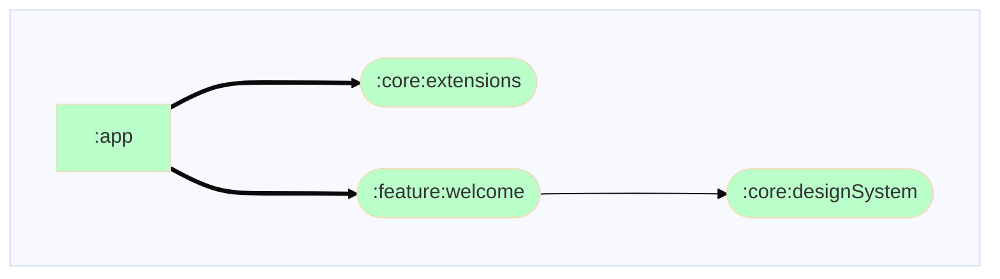

```mermaid
%%{ init: { 'theme': 'base' } }%%
graph LR;

%% Styling for module nodes by type
classDef rootNode stroke-width:4px;
classDef mppNode fill:#ffd2b3,color:#333333;
classDef andNode fill:#baffc9,color:#333333;
classDef javaNode fill:#ffb3ba,color:#333333;

%% Modules
subgraph  
  direction LR;
  :app[:app]:::andNode;
  :core:designSystem([:core:designSystem]):::andNode;
  :core:extensions([:core:extensions]):::andNode;
  :feature:welcome([:feature:welcome]):::andNode;
end

%% Dependencies
:app===>:core:extensions
:app===>:feature:welcome
:feature:welcome--->:core:designSystem

%% Dependents
```